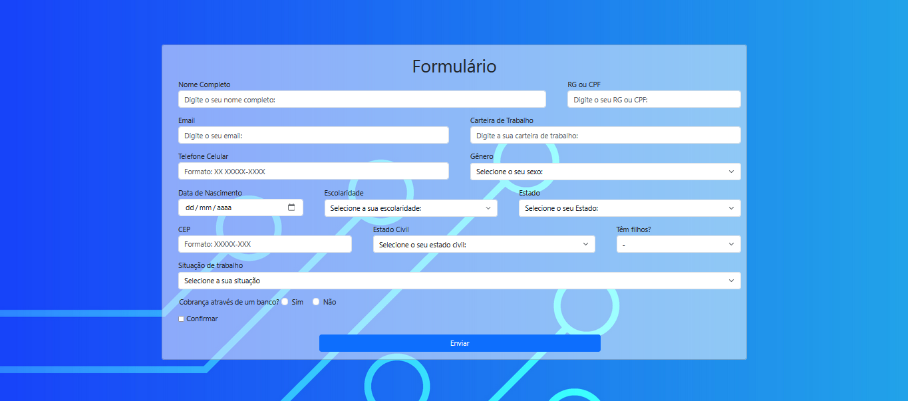
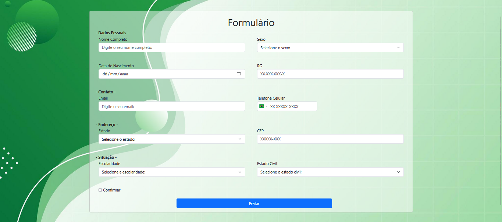

<h2>Second time doing a Formulary</h2>

The first time I created a formulary it was with JavaScript, now I did with PHP! I did some design changes and now it's reponsive!

<figure>
  
  <figcaption>This's the old form that I used JavaScript to upload Data</figcaption>
</figure>
<figure>
  
  <figcaption>And there's the new one, that I used PHP to upload Data</figcaption>
</figure>
